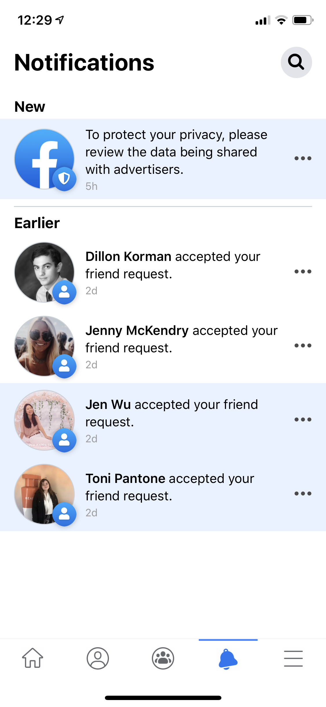
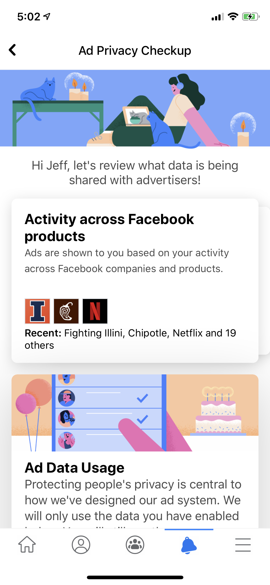
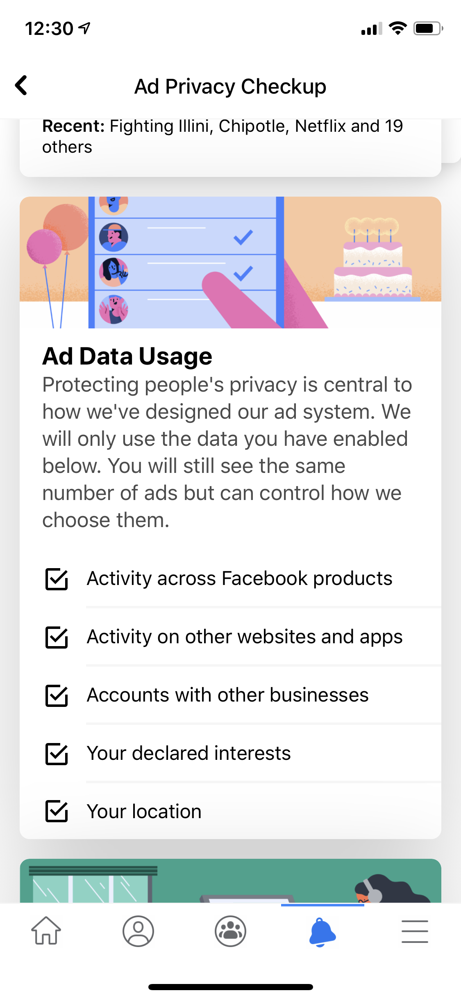
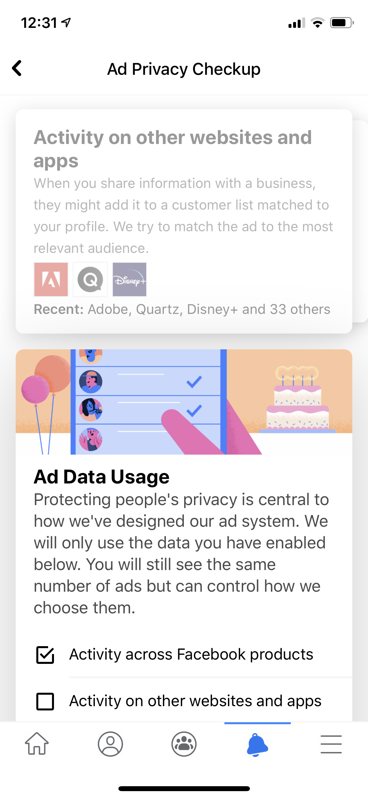

# facebook-data-checkup &middot; Facebook Ad Privacy Prototype

We did a research project on Facebook's ad privacy and preferences as well as user sentiment. We conducted research and recorded user interactions as they performed various tasks to identify the best way to improve the overall experience as well as improve users' trust in Facebook as a brand. The goal was to find a solution that would have the minimum negative impact on Facebook's revenue as well as the greatest positive impact on their brand and future success.

We concluded a few key issues with the existing platform and we were tasked to build a solution that would improve transparency, trust, and make it easier for users to manage their data privacy for targeted advertising. The key component was the addition of a semi-regular notification to users to remind them to check on their privacy settings since only 12% of users knew there were settings in the first place and only 36% of users were comfortable with all of the information being shared. We found that the vast majority of users did actually prefer targeted over random advertising but wanted more control over what went into that targeting. The existing interface is far too complex, lacks a consistent design, and was too confusing for users to navigate based on our research and user testing. With that in mind, we designed and built a new page for the Facebook app that would be opened from clicking on the notification. In this page the user would be presented with quick access to review recent data shared with advertisers as well as easily change some of the most common high level settings. It also offers a deeper dive to reach the full settings if desired.

## Development

The app was built in `React Native` which is the framework used by Facebook.

| command      | description                                                  |
| ------------ | ------------------------------------------------------------ |
| `expo start` | run the development server. Add the `-c` flag to clear cache |

## Demo

[Facebook currently](https://drive.google.com/file/d/1rUAimT_Inx_6lK4KIYJyAfkjRMVjHHjN/view?usp=sharing)

[Our proposal](https://drive.google.com/file/d/10o2Wo48ToOHCoJKLK79SqCgsU_jGYUX-/view?usp=sharing)

## Screenshots

#### Notifications Page

A semi-regular notification to provide the user with a reminder, as well as access, to their settings

#### Checkup Page

A new page proposal for Facebook that includes explanations of what data is given to advertisers, examples of recent usage, as well as quick access to toggle high level settings.

The page includes subtle interaction details such as a card carousel for each data type, clicking on a card scrolls the user down to the buttons to change the settings, and a jump off point to reach the full verbose settings if necessary.

##### Disclaimer

We do not own the rights to Facebook as well as any associated image assets. Assets were used under the terms of fair use.
